<!-- TOC start (generated with https://github.com/derlin/bitdowntoc) -->

- [Luxe Atlas](#luxe-atlas)
- [Contents](#contents)
  - [User Goals](#user-goals)
  - [User Stories](#user-stories)
  - [Website Goals and Objectives](#website-goals-and-objectives)
  - [Wireframes](#wireframes)
  - [Design Choices](#design-choices)
    - [Typography](#typography)
    - [Colour Scheme](#colour-scheme)
    - [Images and Logo](#images-and-logo)
    - [Responsiveness](#responsiveness)
  - [Features](#features)
    - [Nav Bar](#nav-bar)
    - [About page](#about-page)
    - [Locations page](#locations-page)
    - [Gallery page](#gallery-page)
    - [Contact page](#contact-page)
    - [Footer](#footer)
- [Technologies Used](#technologies-used)
  - [Libraries and Frameworks](#libraries-and-frameworks)
  - [Tools](#tools)
- [Testing](#testing)
  - [Bugs](#bugs)
  - [Responsiveness Tests](#responsiveness-tests)
  - [Code Validation](#code-validation)
    - [HTML](#html)
    - [CSS](#css)
    - [JavaScript](#javascript)
      - [Manual vs Automated Testing.](#manual-vs-automated-testing)
  - [User Story Testing](#user-story-testing)
  - [Features Testing](#features-testing)
  - [Accessibility Testing](#accessibility-testing)
  - [Lighthouse Testing](#lighthouse-testing)
  - [Browser Capability Testing](#browser-capability-testing)
- [Deployment](#deployment)
  - [To deploy the project](#to-deploy-the-project)
  - [To fork the project](#to-fork-the-project)
  - [To clone the project](#to-clone-the-project)
- [Credits](#credits)
  - [Feedback, advice and support](#feedback-advice-and-support)
  - [Code inspiration and learning content](#code-inspiration-and-learning-content)
  - [Visual content](#visual-content)
  - [Images](#images)

<!-- TOC -->

# Luxe Atlas

<!-- TOC -->

# Contents

<!-- TOC -->

## User Goals

- User friendly navigation.
- Display photos of luxury hotels and locations.
- Ability to provide feedback with ease.
- Able to follow Luxe Atlas on social media.
- Ability to research places without leaving the site.
- Gain subscribers through newsletter.

<!-- TOC -->

## User Stories

- As a user, I expected to plan my trip via Google Maps/Places.
- As a user, I expect to find the site easy to use and navigate.
- As a user, I expect to find details on appointments and location.
- As a user, I would like to send feedback about your services.
- As a user, I would use social media to contact Luxe Atlas.
- As a user, I would like to see images of where I could go.
- As a user, I want to be able to find luxury hotels and resorts quickly.

<!-- TOC -->

## Website Goals and Objectives

- Increase awareness of Luxe Atlas.
- Encourage social media engagement and feedback.
- Invite users to provide feedback and send messages through social media.
- Offer Google services to prolong engagement with user.
- Attract high end travellers and luxury seekers through content.
- Increase overall website traffic by increasing rankings on search engine.

<!-- TOC -->

## Wireframes

- [Mobile wireframe](docs/mobile-version.pdf)
- [Tablet wireframe](docs/tablet-version.pdf)
- [Desktop wireframe](docs/desktop-version.pdf)

<!-- TOC -->

## Design Choices

<!-- TOC -->

### Typography

The font family chosen for Luxe Atlas is Lato for the first/main body and Playfair Display for the Headings/secondary font. Lato is clean and easy to read and Playfair Display represents the luxury travel side of the page.

<!-- TOC -->

### Colour Scheme

| --primary-font:     | "Lato",             | sans-serif; |
| ------------------- | ------------------- | ----------- |
| --secondary-font:   | "Playfair Display", | serif;      |
| --primary-color:    | #9a031a;            |             |
| --secondary-color:  | #0f4c5c;            |             |
| --third-color:      | #cca43b;            |             |
| --light-color:      | #ffffff;            |             |
| --dark-color:       | #000000;            |             |
| --background-color: | rgba(8, 8, 8, 0.5); |             |
| --bs-gutter-x:      | 0;                  |             |

<!-- TOC -->

### Images and Logo

<!-- TOC -->

### Responsiveness

| Breakpoint        | Class infix | Dimensions |
| ----------------- | ----------- | ---------- |
| Extra small       | None        | <576px     |
| Small             | sm          | ≥576px     |
| Medium            | md          | ≥768px     |
| Large             | lg          | ≥992px     |
| Extra large       | xl          | ≥1200px    |
| Extra extra large | xxl         | ≥1400px    |

<!-- TOC -->

## Features

The layout of Luxe Atlas is image heavy showing the user the type and quality of service which is provided. There are fives pages including home, locations, about, contact and gallery. The about contains a feedback form and there is Google Maps which provides places and journey planning for the user.

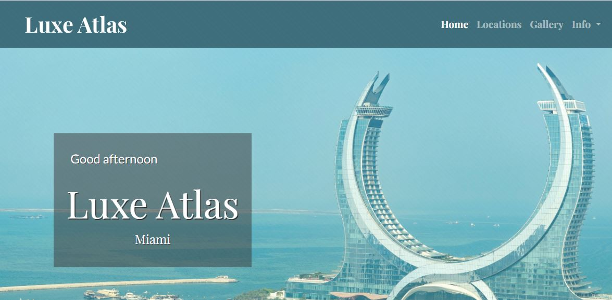
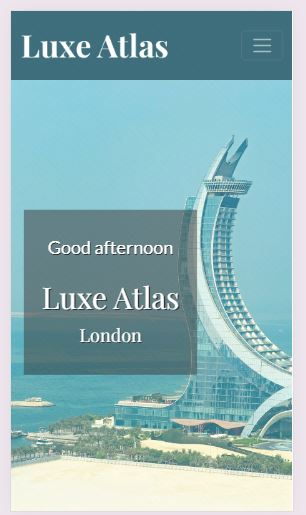

<!-- TOC -->

### Nav Bar

The navigation bar (nav bar) is a menu, usually located at the top of a website, that helps users easily move between different sections. It helps the user understand the structure of the site, stay orientiated while browsing and access important features.

<!-- TOC -->

### About page

The user will find out about the purpose and also the opening times of Luxe Atlas. There is also a feedback form and map to Luxe Atlas. The user will be able to find out the goals and reasons for the creation of Luxe Atlas. It’s Luxe Atlas chance to introduce the business, organization, or personal brand in a clear and engaging way.
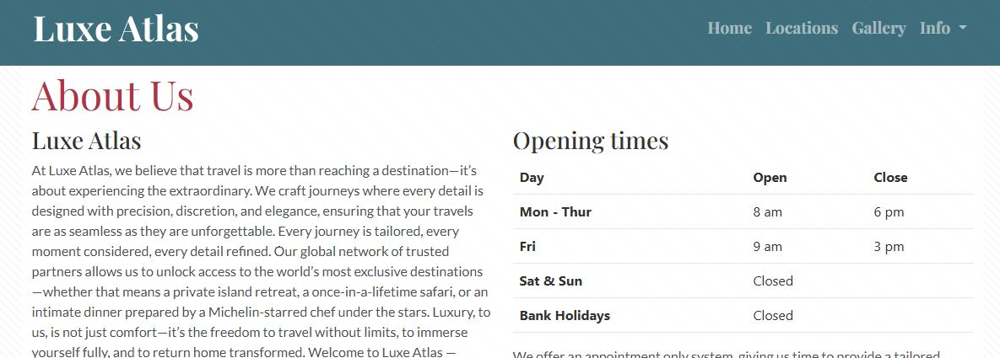
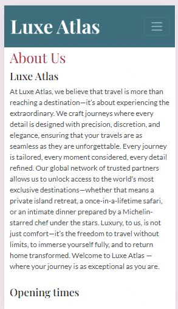

<!-- TOC -->

### Locations page

The user will find Google Maps on this page. Through Google Maps, the user can find locations, resorts, hotels and plan their journey which will then be prepared and booked through Luxe Atlas. Google Maps also incorporates Google Places.
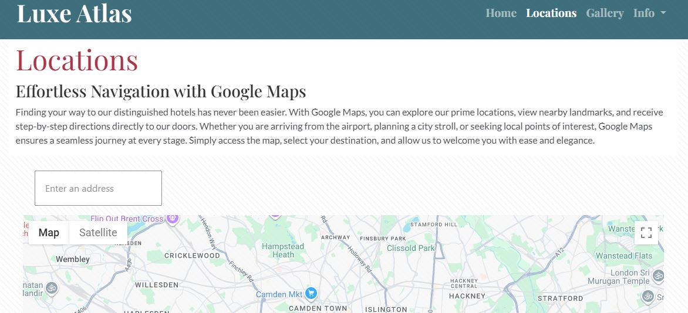
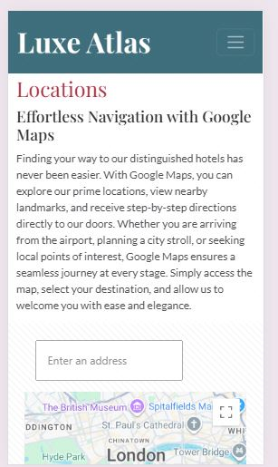

<!-- TOC -->

### Gallery page

The Gallery section of Luxe Atlas gives the user a visual glimpse into the hotels, resorts and accommodation which can be booked through Luxe Altas. The gallery section shows locations in cities, beach areas and countryside. The gallery helps the user see the environment and the people, get a feel for the vibe and visualize the experience.

<!-- TOC -->

### Contact page

The Contact section of Luxe Atlas is where users go to get in touch with us behind the site. It's the main gateway for communication. The section has a contact us form. The user can reach out for questions and inquiries, find essential contact details and get directions. The Contact section makes it easy and convenient for the user to connect, get help, or take the next step in their journey with Luxe Atlas.
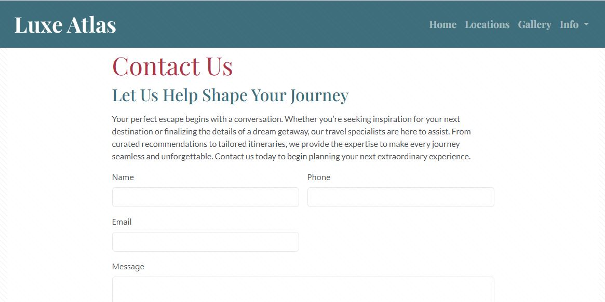
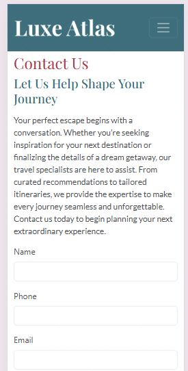

<!-- TOC -->

### Footer

The Footer section of a website is the area at the very bottom of the page that provides users with quick access to important information and navigation links. For the user, the footer helps them to access social media profiles, see contact details such as address, telephone number, email etc, get business addrss and links to pages under the Directory. The footer behaves like a quick-reference area that helps the user take action or find key info at any point during their visit.

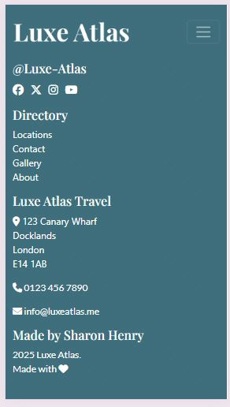

<!-- TOC -->

# Technologies Used

<!-- TOC -->

## Libraries and Frameworks

- [Google Fonts](https://fonts.google.com/ "Google Fonts")
- [Font Awesome](https://fontawesome.com "Font Awesome")
- [Favicon](https://favicon.io/ "Favicon")

<!-- TOC -->

## Tools

- [GitHub](https://github.com/ "GitHub")
- [Balsamiq](https://balsamiq.com/ "Balsamiq")
- [Color Contrast Checker](https://color-contrast-checker.deque.com/ "Color Contrast Checker")
- [Email JS](https://www.emailjs.com/ "Email JS")

<!-- TOC -->

# Testing

<!-- TOC -->

## Bugs

Luxe Atlas links and buttons were thoroughly tested. Please are the bugs found and fixed.

| Bug                                               | Status | Description                                                              | Steps to resolve                                                   |
| ------------------------------------------------- | ------ | ------------------------------------------------------------------------ | ------------------------------------------------------------------ |
| Google Map APi not loading                        | FIXED  | Google Map API had to be manually reload through button                  | Map loaded through Google Cloud adjustments                        |
| Enter an address not showing in Google Maps FIXED | FIXED  | The javascript is there for enter an address but does not show on page   | Added input box and remove irrelevant script                       |
| Header image not spanning the screen              | FIXED  | Hero image does not cover the width of the screen                        | Reviewed and replaced the background image and code                |
| Scrolling text not working                        | FIXED  | Scrolling text would not appear on main image                            | Ensured that the jQuery script was in the correct location         |
| Gallery images not changing colour                | FIXED  | The Gallery images meant to go from grayscale to full colour on click    | Checked the jQuery script was loaded correctly and checked the CSS |
| Google Maps autocomplete stopped working          | FIXED  | The locations page would not suggest or autocomplete addresses           | Amended the JavaScript to the previous state                       |
| Error messages appear about Google Maps           | FIXED  | Google maps stating that Marker and Place Autocomplet will be depracated | Referred back to old version as autocomplete works                 |
| Error messages appear in Dev Tools                | FIXED  | Error messages appear when clicking outside of the search box            | Error are nothing to do with JavaScript or HTML                    |

<!-- TOC -->

## Responsiveness Tests

I launched the webpage at the start to test the responsiveness with Chrome Developer Tools. I followed the mobile first practice and checked responsiveness inside Google Chrome.

Deployed versions were tested using the external website Responsive Design Checker. The Am I Responsive website was another external source that was used to obtain a unified view of different device breakpoints.

I have a Website Responsiveness Checker extension on Google Chrome to evaluate the responsiveness of even more specialized devices. Device samples were examined for navigation, element alignment, content layout, and functionality concerns at different breakpoints. I gave the headings more breathing room which appeared better on all devices. The hamburger icon showed only on mobile screens to enhance user experience as a result of the testing.

| Size | Device Example     | Navigation | Element Alignments | Content Placement | Functionality |
| ---- | ------------------ | ---------- | ------------------ | ----------------- | ------------- |
| sm   | Samsung Galaxy S20 | Good       | Good               | Good              | Good          |
| sm   | iPhone 11 PRO      | Good       | Good               | Good              | Good          |
| sm   | iPhone 12 mini     | Good       | Good               | Good              | Good          |
| md   | iPad MINI          | Good       | Good               | Good              | Good          |
| md   | Galaxy Tab S7      | Good       | Good               | Good              | Good          |
| md   | iPad Air 4         | Good       | Good               | Good              | Good          |
| lg   | iPad Pro 11        | Good       | Good               | Good              | Good          |
| xl   | Macbook Air        | Good       | Good               | Good              | Good          |
| xl   | Galaxy Fold2       | Good       | Good               | Good              | Good          |
| xxl  | Dell Inspiron 3521 | Good       | Good               | Good              | Good          |
| xxl  | Desktop            | Good       | Good               | Good              | Good          |

<!-- TOC -->

## Code Validation

<!-- TOC -->

### HTML

<!-- TOC -->

### CSS

<!-- TOC -->

### JavaScript

#### Manual vs Automated Testing.

The difference between manual and automated testing is that Manual testing is about human usability (everything that a human can test). It is also visual and about code validation. Automated testing is verifying the code is doing what it is expected to do.

JS code was validated on JSHint. No errors identified.

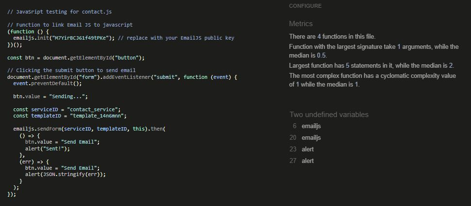

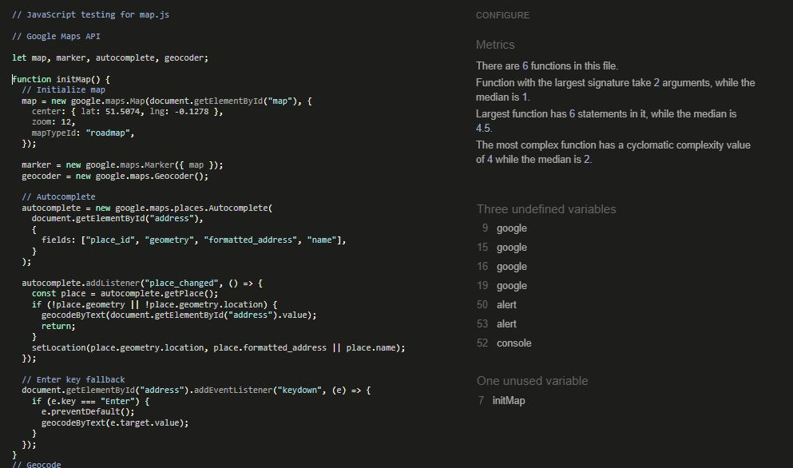
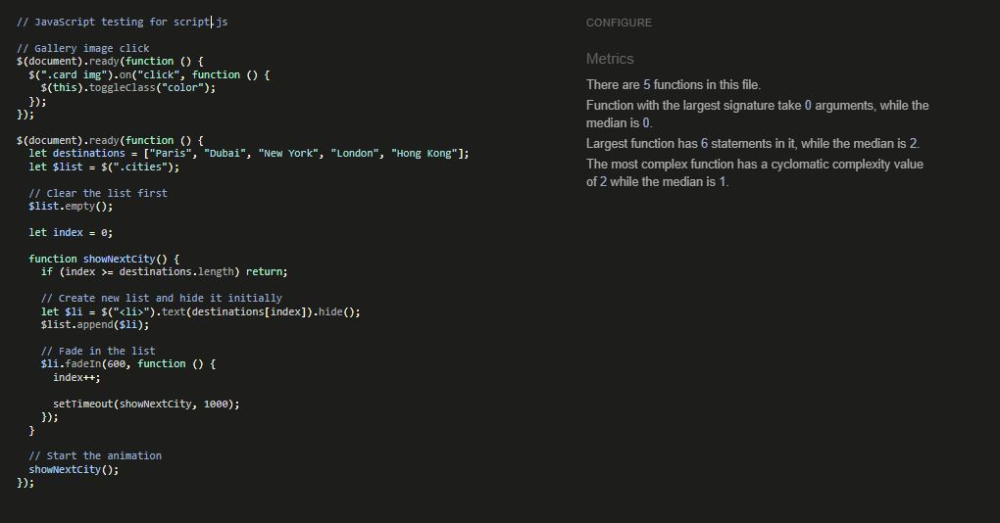

<!-- TOC -->

## User Story Testing

| User Story                                                             | Result                                                                         | Pass | Screenshot                                |
| ---------------------------------------------------------------------- | ------------------------------------------------------------------------------ | ---- | ----------------------------------------- |
| As a user, I want to be able to find luxury hotels and resorts quickly | The site has Google Maps and Places where you can search where you want to get | Yes  | [User Testing 1](docs/user-testing-1.JPG) |
| As a user, I want to find out how to contact Luxe Atlas                | The user can go to the contact section and send a message                      | Yes  | [User Testing 2](docs/user-testing-2.JPG) |
| As a user, I would like to see images of where I could go.             | The gallery section shows you the resorts and hotels we book.                  | Yes  | [User Testing 3](docs/user-testing-3.JPG) |
| As a user, I want to contact Luxe Atlas on social media.               | Social media links can be found in the footer                                  | Yes  | [User Testing 4](docs/user-testing-4.JPG) |
| As a user, I would like to subscribe and send feedback.                | There is a feedback form in the about section                                  | Yes  | [User Testing 5](docs/user-testing-5.JPG) |
| As a user, I expect to find the site easy to use and navigate.         | The site has a navigation bar and a directory of pages in the footer           | Yes  | [User Testing 6](docs/user-testing-6.JPG) |
| As a user, I expect to find details on appointments and location.      | There are opening times and map in about page                                  | Yes  | [User Testing 5](docs/user-testing-7.JPG) |

<!-- TOC -->

## Features Testing

This website was extensively tested for functionality using both Chrome and Edge developer tools.

Every feature was manually tested using the test script and outcomes recorded.

| Feature                                       | Description                                                            | Steps                                                  | Outcome                                                                      |
| --------------------------------------------- | ---------------------------------------------------------------------- | ------------------------------------------------------ | ---------------------------------------------------------------------------- |
| Nav Bar and links hover colour gold.          | Hover over links                                                       | Link will change colour                                | Link will turn gold                                                          |
| Social media links to open on new tab.        | Click on social media links.                                           | Relevant pages to open in new tab.                     | Social media pages to open in new tab.                                       |
| 404 error page                                | Page not found appears when wrong address entered.                     | Page not found opens in same tab                       | Click on return to homepage when it appears.                                 |
| Feedback form in about page.                  | Feedback form for the user.                                            | Fill out details and send                              | User receives email about feedback                                           |
| Contact form                                  | User can use the contact form to message us.                           | Enter details and press button                         | Alert box confirms email sent and user receives email confirming receipt     |
| Dropdown menu on nav bar                      | Dropdown menu called info on navigation bar.                           | Click on down arrow on navigation bar                  | When arrow is clicked on additional page are shown.                          |
| Mobile menu hamburger contains links.         | Click on the mobile menu icon.                                         | Mobile menu to reveal web links when clicked.          | Mobile menu opens and displays the links.                                    |
| Mobile menu to close when option is selected. | Select link on mobile menu.                                            | Click on hamburger icon to close menu after selection. | Required section will show and menu will be closed.                          |
| Return to homepage link in the 404 page.      | Click on Return to homepage link on 404 page.                          | Click on button to return to Homepage                  | Homepage opened.                                                             |
| Return to homepage link hover colour.         | Hover over return to homepage link on Thank you page.                  | Background colour change to lighter blue.              | On hover, background colour changed to red.                                  |
| Search box on Locations page for Google Maps  | Search box next to Google Maps                                         | Enter details to find locations with Google Maps       | User enters required details to find location.                               |
| Gallery images turn to colour.                | Gallery images are black and white and turn to colour when clicked on. | Click on image to change to full colour.               | On click the image change colour and click again to turn to black and white. |
| Map on about page to find Luxe Atlas          | Iframe map to give directions to office                                | User can get directions from Google Maps               | User finds best directions to reach office.                                  |

<!-- TOC -->

## Accessibility Testing

I used web accessibility evaluation tool WAVE Tool which helps to determine if there were accessibility issues on my pages and if there was enough contrasting elements. No issues were raised.

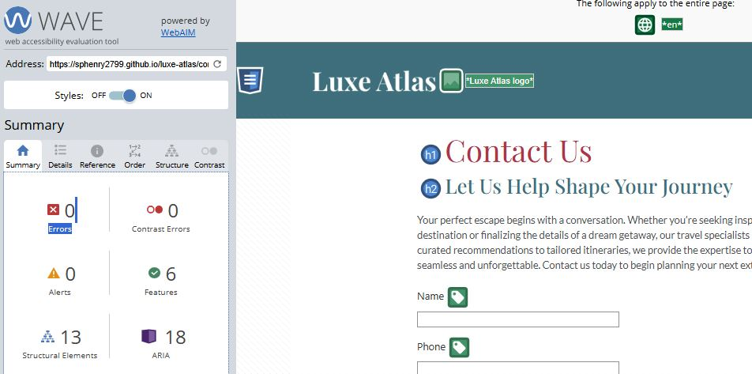

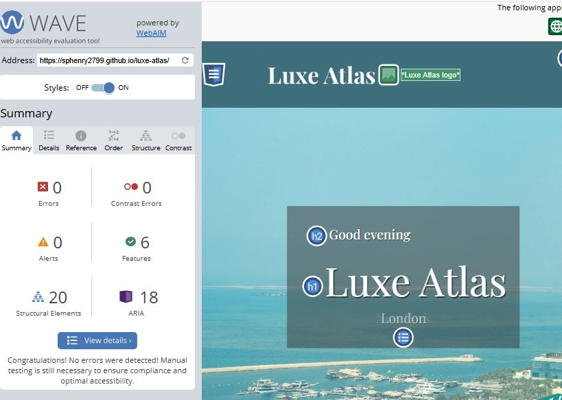

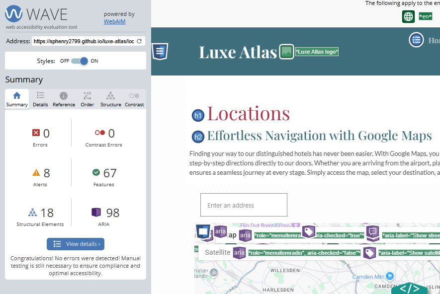

<!-- TOC -->

## Lighthouse Testing

Luxe Atlas has been tested in the Chrome Dev Tools using Lighthouse Testing tool which inspects and scores the website for the criteria below:

Accessibility - test analyses how well people who use assistive technologies can use your website.

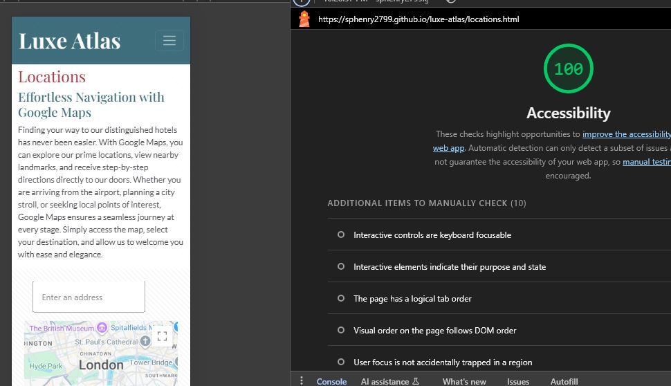
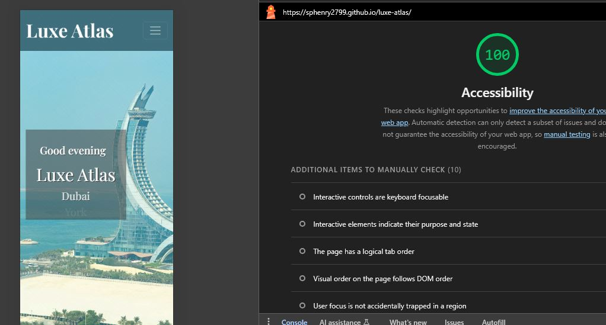
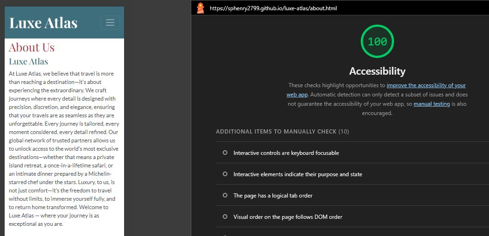
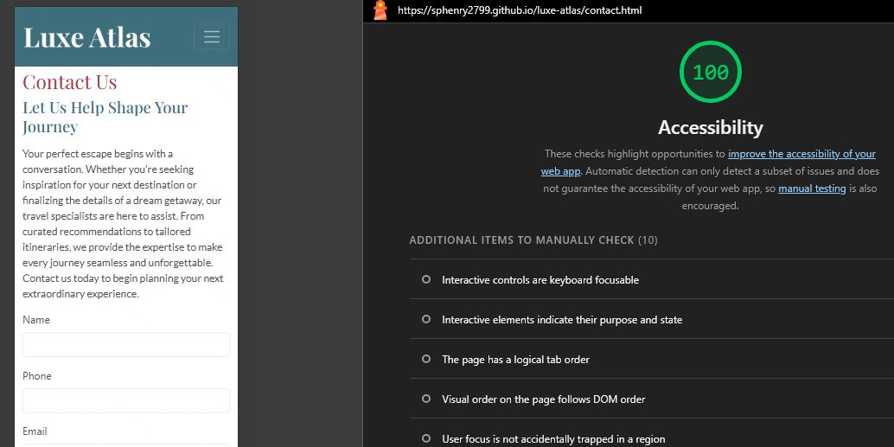
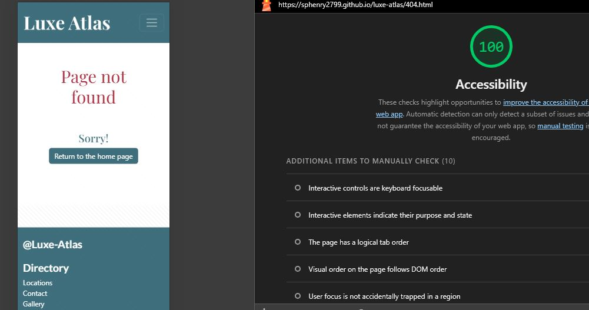

<!-- TOC -->

## Browser Capability Testing

I used the site PowerMapper to test the capability of browsers including Microsoft Edge, Chrome, Firefox, Safari and Opera. iOS and Android were also tested.

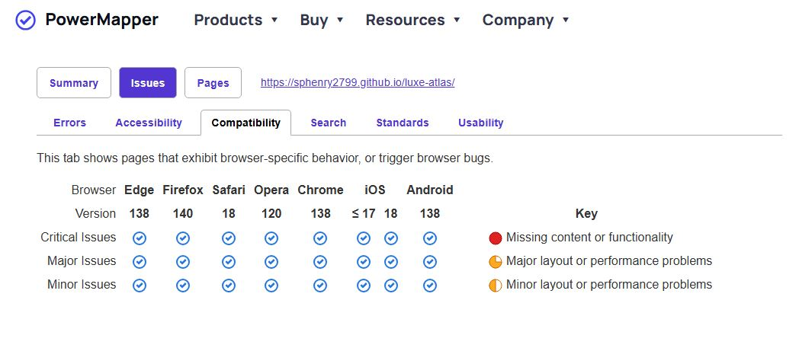

<!-- TOC -->

# Deployment

<!-- TOC -->

## To deploy the project

The Luxe Atlas github site was deployed early in the process to GitHub pages via the following steps:

- Navigate to the repository on GitHub and click on Settings.

- In the side navigation and select Pages.

- In the None dropdown and choose Main.

- Click on the Save button.

The website is now live at https://sphenry2799.github.io/luxe-atlas/.

Any changes required to the website, they can be made by being saved committed and pushed to GitHub using VS Code.

<!-- TOC -->

## To fork the project

Forking the GitHub repository allows you to create a duplicate of a local repository. This is done so that modifications to the copy can be performed without compromising the original repository.

- Log in to GitHub.
- Locate the repository.
- Click to open it.
- The fork button is located on the right side of the repository menu.
- To copy the repository to your GitHub account, click the button.

<!-- TOC -->

## To clone the project

- Log in to GitHub.
- Navigate to the main page of the repository and click Code.
- Copy the URL for the repository.
- Open your local IDE.
- Change the current working directory to the location where you want the cloned directory.
- Type git clone, and then paste the URL you copied earlier.
- Press Enter to create your local clone.

<!-- TOC -->

# Credits

<!-- TOC -->

## Feedback, advice and support

- [Rory Patrick Sheridan](https://discord.com/users/1399706177247645866 "Rory Patrick Sheridan")

<!-- TOC -->

## Code inspiration and learning content

- [Educative](https://www.educative.io/ "Educative")
- [Google Cloud](https//cloud.google.com/ "Google Cloud")
- [Chat GPT](https:www.chatgpt.com/ "Chat GPT")

<!-- TOC -->

## Visual content

- [Coolors](https://coolors.co "Coolors")
- [Magic Pattern](https://magicpattern.design "Magic Pattern")

<!-- TOC -->

## Images

- [Pexels](https://pexels.com "Pexels")
