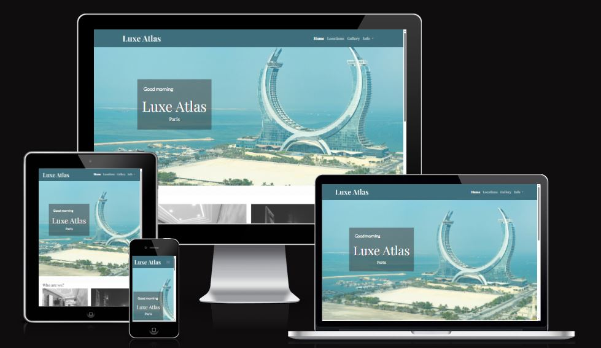
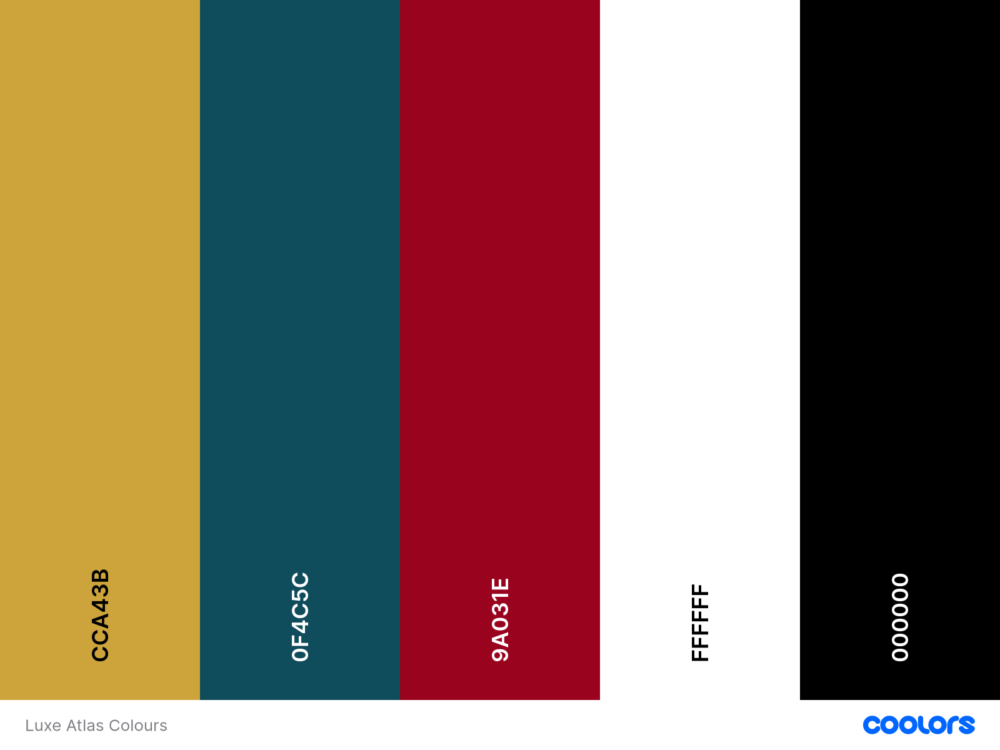

# Luxe Atlas

;

# Contents

## User Goals

- User friendly navigation.
- Display photos of luxury hotels and locations.
- Ability to provide feedback with ease.
- Able to follow Luxe Atlas on social media.
- Ability to research places without leaving the site.
- Gain subscribers through newsletter.

## User Stories

- As a user, I expected to plan my trip via Google Maps/Places.
- As a user, I expect to find the site easy to use and navigate.
- As a user, I expect to find details on appointments and location.
- As a user, I would like to send feedback about your services.
- As a user, I would use social media to contact Luxe Atlas.
- As a user, I would like to see images of where I could go.
- As a user, I want to be able to find luxury hotels and resorts quickly.

## Website Goals and Objectives

- Increase awareness of Luxe Atlas.
- Encourage social media engagement and feedback.
- Invite users to provide feedback and send messages through social media.
- Offer Google services to prolong engagement with user.
- Attract high end travellers and luxury seekers through content.
- Increase overall website traffic by increasing rankings on search engine.

## Wireframes

- [Mobile wireframe](docs/mobile-version.pdf)
- [Tablet wireframe](docs/tablet-version.pdf)
- [Desktop wireframe](docs/desktop-version.pdf)

## Design Choices

### Typography

The font family chosen for Luxe Atlas is Lato for the first/main body and Playfair Display for the Headings/secondary font. Lato is clean and easy to read and Playfair Display represents the luxury travel side of the page.

### Colour Scheme

### Images and Logo

### Responsiveness

| Breakpoint        | Class infix | Dimensions |
| ----------------- | ----------- | ---------- |
| Extra small       | None        | <576px     |
| Small             | sm          | ≥576px     |
| Medium            | md          | ≥768px     |
| Large             | lg          | ≥992px     |
| Extra large       | xl          | ≥1200px    |
| Extra extra large | xxl         | ≥1400px    |

## Features

### Nav Bar

### About page

### Location page

### Gallery page

### Contact page

### Footer

# Technologies Used

## Libraries and Frameworks

- [Google Fonts](https://fonts.google.com/ "Google Fonts")
- [Font Awesome](https://fontawesome.com "Font Awesome")
- [Favicon](https://favicon.io/ "Favicon")

## Tools

- [GitHub](https://github.com/ "GitHub")
- [Balsamiq](https://balsamiq.com/ "Balsamiq")
- [Color Contrast Checker](https://color-contrast-checker.deque.com/ "Color Contrast Checker")

# Testing

## Bugs

Luxe Atlas links and buttons were thoroughly tested. Please are the bugs found and fixed.

| Bug                                               | Status | Description                                                              | Steps to resolve                                                   |
| ------------------------------------------------- | ------ | ------------------------------------------------------------------------ | ------------------------------------------------------------------ |
| Google Map APi not loading                        | FIXED  | Google Map API had to be manually reload through button                  | Map loaded through Google Cloud adjustments                        |
| Enter an address not showing in Google Maps FIXED | FIXED  | The javascript is there for enter an address but does not show on page   | Added input box and remove irrelevant script                       |
| Header image not spanning the screen              | FIXED  | Hero image does not cover the width of the screen                        | Reviewed and replaced the background image and code                |
| Scrolling text not working                        | FIXED  | Scrolling text would not appear on main image                            | Ensured that the jQuery script was in the correct location         |
| Gallery images not changing colour                | FIXED  | The Gallery images meant to go from grayscale to full colour on click    | Checked the jQuery script was loaded correctly and checked the CSS |
| Google Maps autocomplete stopped working          | FIXED  | The locations page would not suggest or autocomplete addresses           | Amended the JavaScript to the previous state                       |
| Error messages appear about Google Maps           | FIXED  | Google maps stating that Marker and Place Autocomplet will be depracated | Referred back to old version as autocomplete works                 |
| Error messages appear in Dev Tools                | FIXED  | Error messages appear when clicking outside of the search box            | Error are nothing to do with JavaScript or HTML                    |

## Responsiveness Tests

I launched the webpage at the start to test the responsiveness with Chrome Developer Tools. I followed the mobile first practice and checked responsiveness inside Google Chrome.

Deployed versions were tested using the external website Responsive Design Checker. The Am I Responsive website was another external source that was used to obtain a unified view of different device breakpoints.

I have a Website Responsiveness Checker extension on Google Chrome to evaluate the responsiveness of even more specialized devices. Device samples were examined for navigation, element alignment, content layout, and functionality concerns at different breakpoints. I gave the headings more breathing room which appeared better on all devices. The hamburger icon showed only on mobile screens to enhance user experience as a result of the testing.

| Size | Device Example     | Navigation | Element Alignments | Content Placement | Functionality |
| ---- | ------------------ | ---------- | ------------------ | ----------------- | ------------- |
| sm   | Samsung Galaxy S20 | Good       | Good               | Good              | Good          |
| sm   | iPhone 11 PRO      | Good       | Good               | Good              | Good          |
| sm   | iPhone 12 mini     | Good       | Good               | Good              | Good          |
| md   | iPad MINI          | Good       | Good               | Good              | Good          |
| md   | Galaxy Tab S7      | Good       | Good               | Good              | Good          |
| md   | iPad Air 4         | Good       | Good               | Good              | Good          |
| lg   | iPad Pro 11        | Good       | Good               | Good              | Good          |
| xl   | Macbook Air        | Good       | Good               | Good              | Good          |
| xl   | Galaxy Fold2       | Good       | Good               | Good              | Good          |
| xxl  | Dell Inspiron 3521 | Good       | Good               | Good              | Good          |
| xxl  | Desktop            | Good       | Good               | Good              | Good          |

## Code Validation

### HTML

;

### CSS

;

### JavaScript

JS Hint

## User Story Testing

| User Story                                                             | Result                                                                         | Pass | Screenshot                                |
| ---------------------------------------------------------------------- | ------------------------------------------------------------------------------ | ---- | ----------------------------------------- |
| As a user, I want to be able to find luxury hotels and resorts quickly | The site has Google Maps and Places where you can search where you want to get | Yes  | [User Testing 1](docs/user-testing-1.JPG) |
| As a user, I want to find out how to contact Luxe Atlas                | The user can go to the contact section and send a message                      | Yes  | [User Testing 2](docs/user-testing-2.JPG) |
| As a user, I would like to see images of where I could go.             | The gallery section shows you the resorts and hotels we book.                  | Yes  | [User Testing 3](docs/user-testing-3.JPG) |
| As a user, I want to contact Luxe Atlas on social media.               | Social media links can be found in the footer                                  | Yes  | [User Testing 4](docs/user-testing-4.JPG) |
| As a user, I would like to subscribe and send feedback.                | There is a feedback form in the about section                                  | Yes  | [User Testing 5](docs/user-testing-5.JPG) |
| As a user, I expect to find the site easy to use and navigate.         | The site has a navigation bar and a directory of pages in the footer           | Yes  | [User Testing 6](docs/user-testing-6.JPG) |
| As a user, I expect to find details on appointments and location.      | There are opening times and map in about page                                  | Yes  | [User Testing 5](docs/user-testing-7.JPG) |

## Features Testing

## Accessibility Testing

## Lighthouse Testing

**Luxe Atlas has been tested in the Chrome Dev Tools and Microsoft Edge Dev Tools using Lighthouse Testing tool which inspects and scores the website for the criteria below:**

Performance - how quickly a website loads and how quickly users can access it. Accessibility - test analyses how well people who use assistive technologies can use your website. Best Practices - checks whether the page is built on the modern standards of web development. SEO - checks if the website is optimised for search engine result rankings.\_

## Browser Capability Testing

I used the site PowerMapper to test the capability of browsers including Microsoft Edge, Chrome, Firefox, Safari and Opera. iOS and Android were also tested.

# Deployment

## To deploy the project

The Luxe Atlas github site was deployed early in the process to GitHub pages via the following steps:

- Navigate to the repository on GitHub and click on Settings.

- In the side navigation and select Pages.

- In the None dropdown and choose Main.

- Click on the Save button.

The website is now live at https://sphenry2799.github.io/luxe-atlas/.

Any changes required to the website, they can be made by being saved committed and pushed to GitHub using VS Code.

## To fork the project

Forking the GitHub repository allows you to create a duplicate of a local repository. This is done so that modifications to the copy can be performed without compromising the original repository.

- Log in to GitHub.
- Locate the repository.
- Click to open it.
- The fork button is located on the right side of the repository menu.
- To copy the repository to your GitHub account, click the button.

## To clone the project

- Log in to GitHub.
- Navigate to the main page of the repository and click Code.
- Copy the URL for the repository.
- Open your local IDE.
- Change the current working directory to the location where you want the cloned directory.
- Type git clone, and then paste the URL you copied earlier.
- Press Enter to create your local clone.

# Credits

## Feedback, advice and support

Rory Patrick Sheridan proper link

## Code inspiration and learning content

- [Educative](https://www.educative.io/ "Educative")
- [Google Cloud](https//cloud.google.com/ "Google Cloud")
- [Chat GPT](https:www.chatgpt.com/ "Chat GPT")

## Visual content

- [Coolors](https://coolors.co "Coolors")
- [Magic Pattern](https://magicpattern.design "Magic Pattern")

## Images

- [Pexels](https://pexels.com "Pexels")
